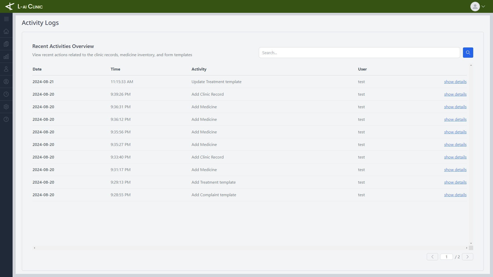

# Clinic Management System

A comprehensive solution designed to streamline clinic operations. It allows for efficient patient record management, from basic details to medical history. The system also includes features for managing medicine inventory, tracking stock levels, and monitoring medicine consumption statistics. This ensures that clinics can maintain accurate records, manage resources effectively, and make data-driven decisions to improve patient care.

## Login Page

Provides a secure and user-friendly interface for authentication. Users can easily access their accounts using their credentials. The system employs JWT (JSON Web Token) for secure session management. Upon successful login, a JWT token is generated and stored, which is used to verify and maintain user sessions across different pages. This ensures a robust and secure method for handling user authentication and protecting sensitive data.

## Register Page

Streamlines the user registration process with enhanced security. Users first request an OTP (One-Time Password) to initiate registration. PHPMailer is used to send the OTP to the user's email. Once the OTP is received, users must enter it to validate their email address before completing the registration form. This approach ensures that only verified email addresses can complete the registration, providing an additional layer of security.

## Dashboard Page

Users can view a summary of medicines, including their stock levels and expiry dates, to manage inventory efficiently. The page also provides functionality to create clinic records. Additionally, users can access a list of emergency hotlines for quick reference, ensuring readiness in urgent situations.

## Clinic Record Form

Allows users to create detailed clinic records efficiently. It features ready-to-use templates for various aspects of patient care, including types of complaints, medication, treatment, and laboratory tests. This structured approach simplifies record-keeping and ensures comprehensive documentation, facilitating better patient management and streamlined workflow.

## Inventory Page

Provides a robust interface for managing medicine stocks. Users can easily create and update medicine entries, track stock levels, and monitor inventory status. Additionally, the page includes a print feature, allowing users to generate and print inventory reports for physical records and reference.

## Adding Medicine Form

Designed to efficiently add new medicines to the inventory system.

## Summarization Page

Offers insights into medicine usage by displaying which medicines are most frequently consumed. Users can view detailed consumption statistics to help with inventory planning and management. The page also includes a print feature, allowing users to generate and print summary reports for offline analysis and record-keeping.

## Clinic Records Page

Provides a comprehensive view of patient records and historical clinic data. Users can access detailed information about individual patients, including their medical history and previous clinic visits. This centralized access to records facilitates efficient patient management and continuity of care.

## Activity Logs Page

Allows users to track and monitor changes within the system. It records detailed logs of who performed actions such as adding or updating records and medicine stock. Users can view timestamps and user details for each action, providing a comprehensive audit trail to ensure accountability and track system changes.

## Settings Page : Form Templates Management
Allows users to manage and customize templates for clinic record forms and medicine addition forms. Users can configure and update suggested templates for complaints, treatments, laboratories, and storage categories. This functionality ensures that forms are tailored to specific needs and improves efficiency in record-keeping and inventory management.

